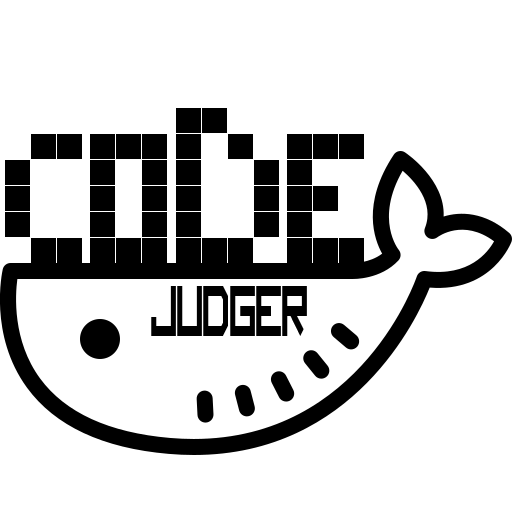

# DJudger

在右上角可切换中英文文档 / Switch Chinese and English in the upper right corner

Docs are under translating.

**If you have any problems or suggestions, welcome to contact with [@NicerWang](https://github.com/NicerWang) or submit an `Issue`.**

## Brief

Docker-based code execution container，currently **supports Java only**.

By using DJudger, you can add code running capacity to your project, and the code runs efficiently and safely. DJudger has concurrent carrying capacity, is compatible with various languages, and supports multiple machines as executing machines.

* **Features：** Easy to Use / Extensible / Nearly Safe / Rapid Response and Dispatch

> If you want to use DJudger as **OJ code runner**, you can use `|` to deal with stdin, current version does not support to redirect stdin.
>
> No intention to develop a Spring Boot Starter.

## Inspiration

In operating system, there are 3 ways to deal with the deadlock: prevention (break one of the four necessary conditions), dynamic avoidance and recovery. Malicious code prevention problem is alike to the deadlock, so here are 3 ways to deal with Malicious code prevention problems discussed.

* Prevention?

  Detect malicious code before code execution, which is abandoned. The macro definition of the C language is almost uncontrollable, so it's easy to carck existing rules. However, this method can be additional part of other methods.

* Dynamic Avoidance?

  This is the most commonly used method today. Through some mechanisms at the bottom of Linux, the system call of the program is restricted, the CPU occupancy rate, execution time, memory occupation and other information of the program are monitored, and malicious behavior is dynamically avoided.

  This method has good performance, but it's difficult to implement. It requires relevant Linux knowledge (ptrace, etc.) and needs to give separate designs for different languages. For example, C needs to prevent attacks at the compilation stage, but Python does not.

* Recovery?

  This is DJudger's solution to this problem. Running code in Docker containers can completely eliminate differences between different languages, and does not require relevant Linux knowledge, and can even run on any system that supports Docker. For each language, you only need to design a Docker image to get a safe and efficient code execution environment.

## Docs Index

* [Quick Start](quick-start.md)

* [API Reference](api-reference.md)

* [Add New Language](add-new-language.md)

* [How to be safe?](how-to-be-safe.md)

* [Structure](project-structure.md)

## Future

* Quick Start Scripts

* Test for common malicious code

* Design of ditribute deploy

* Introduction to structure

* Spring Integration
