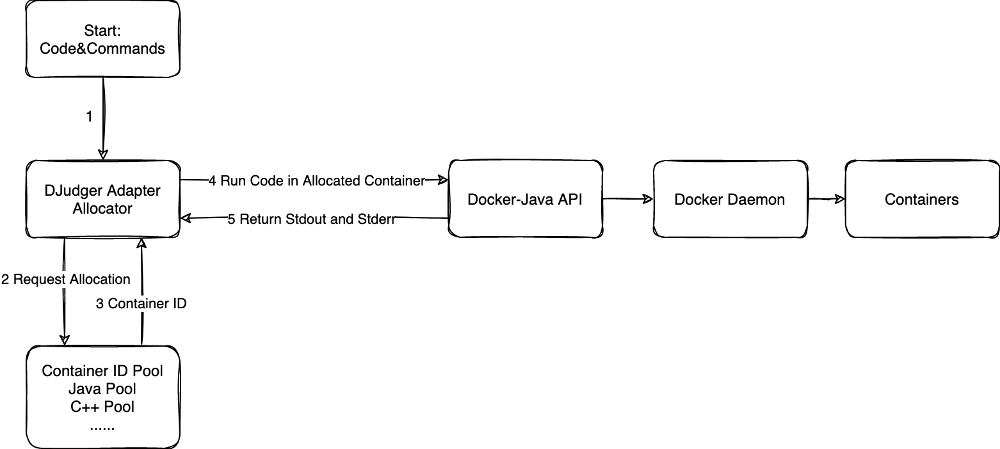

# Structure

## How to execute codes?

The code is actually executed in Docker containers, which originate from customized images, and the containers generated by these images are not responsible for any tasks other than (compiling) execution code.

DJudger actually handles the creation, deletion, allocation, etc. of containers.

## Why need to customize the Docker Image？

1. The corresponding (compilation) execution environment needs to be designed for each language, which is reflected by the Docker image.
2. Code execution is not always successful. Test code needs to be written. After each execution, the container is tested to ensure that the container can carry out follow-up tasks.

