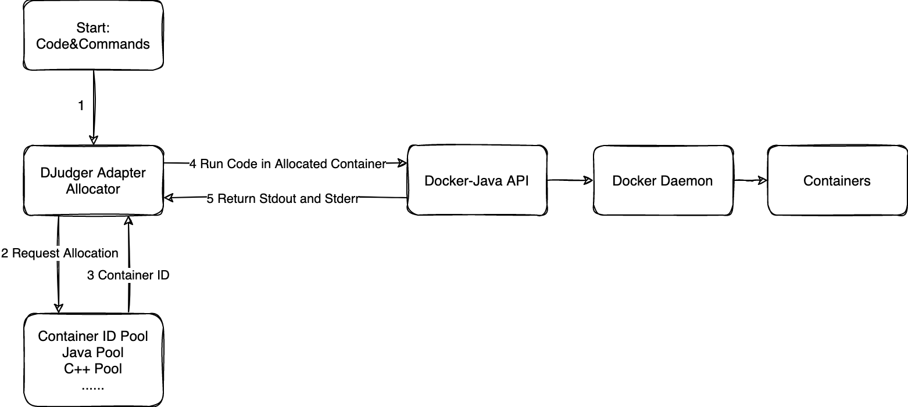

# 项目架构要点

### 代码是如何被执行的？

代码实际上是在 Docker 容器中被执行，这些容器来源于定制的镜像，由这些镜像生成的容器除了（编译）执行代码之外，不负责其他任何任务。

DJudger 实际上处理了容器的创建、删除、分配等工作。

### 为什么需要定制 Docker 镜像？

1. 需要为每种语言设计对应的（编译）执行环境，这一环境就由 Docker 镜像体现。
2. 代码执行并不总是顺利的，需要编写测试代码，在每次运行结束后，对容器进行测试，以保证容器能够顺利执行后续任务。
